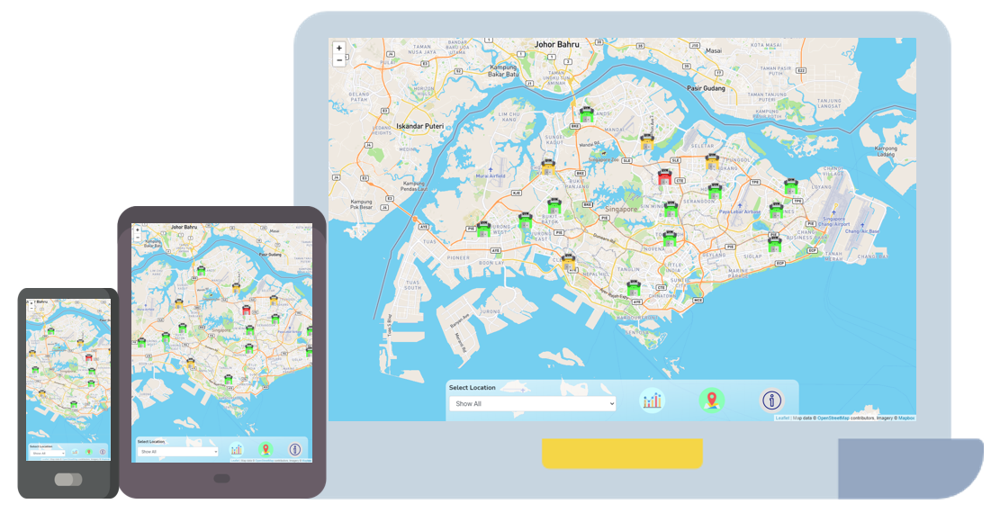
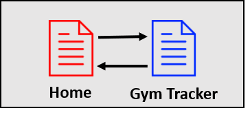
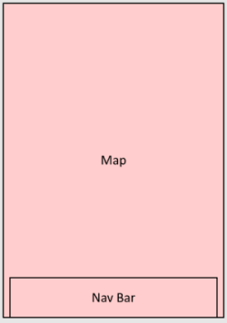
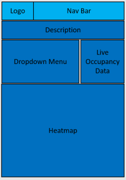
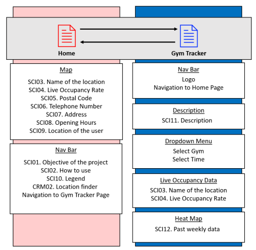

# Interactive Web Application Project

# **LiveFITT.beta**
## Context
This project includes writing custom HTML5, CSS3 and Vanila JavaScript code to create a webpage that serve the following purpose: 
* Show the user where are the location of the ActiveSG Gyms(hereinafter, known as "gym") in Singapore.
* Display the live occupancy rate and the average occupancy of each gym over one-hour periods in the past week.
* Allow users to read and interact with the data chart to plan out future visits.

User's goal: To see the location and current occupancy rate of the nearest gym based on their current position.

Site owner's goal: To showcase proficiency in the mentioned programming language.

## Access
Url to live site: https://yongsannnn.github.io/Assignment-One/index.html




# Defining the Project
The purpose of this website is to aid users in the process of deciding when to head down to the gym. 

With the current pax limit imposed to businesses, information such as occupancy rate becomes crucial. 

By providing with the said info, it will help users decide when and which outlet to visit. 

# Strategy
## Identifying External Users
With the primary purpose mentioned above, the website's primary users should be Fitness/Gym enthusiast across all ages. 

## Identifying External Users' Goals
The users' goal here is to get the neccessary information they want to make a decision. 

Therefore, the interface should be simple to understand and easy to interact with.  

```
EUG01. See all location of the gyms.
EUG02. Find out which gym is closest from their current location.
EUG03. See key information of the selected outlet. Such as, opening hours, address and occupancy rate
EUG04. Interact with the chart to filter/compare outlet past weekly data and live occupancy rate. 
EUG05. To decided which gym to visit at specific timing.
```

## Identifying Users Pain Point
With the pax restrictions imposed to businesses due to health and safety protocol. Users find themselves with the following pain points. 

``` 
UPP01. Do not want to visit a gym that is fully occupied. 
UPP02. Wants to visit the gym but don't know where is the nearest outlet. 
UPP03. Wants to plan for future trip but do not know how occupied it is during various time and day. 
``` 

## Identifying Site Owner's Goals
As a start of my journey to become a software developer. My goal as the site owner is to showcase my proficiency in HTML5/CSS3/Vanila JavaScript.

```
SOG1. Showcase my proficiency in HTML5/CSS3/Vanila JavaScript.
SOG2. Provide a platform to solve users pain point 
```

## User stories
```
US01. As a user, I want to look at all the outlets, so that I know where are they located.
US02. As a user, I want to know which outlet is closest to me, so that I avoid travelling too far. 
US03. As a user, I want to see the details of the outlet chosen, so that I contact/travel to the gym.
US04. As a user, I want to know how filled the gym is now, so that I know if I should visit it now.
US05. As a user, I want to know the past occupancy data, so that I can plan my future trip. 
```

# Scope
## Functional Requirement
```
FR01. Intreactive map to satisfy user need.
FR02. User can enable his location and use it and find the nearest outlet. 
FR03. User should be able to interact with the chart to filter/compare different outlet's past & live occupancy.
FR05. Live data of the occupancy rate should be updating without the need of the user to trigger a refresh. 
FR06. Use advance CSS/JavaScript to showcase proficiency.
FR07. Mobile responsive to decides such as Phone, Tablet and Laptop.
FR08. Navigational bar to toggle between pages. 
``` 

## Non-Functional Requirement
```
NFR01. Ensure readability.
NFR02. For security purpose, location of users should not be stored.
```

## Content Requirement
### Mandatory Requirement
The list below contains the mandatory requirement for the site to meet all of the users goals (EUG01-05).

```
CRM01. Interactive Map. (EUG01)
CRM02. Location finder. (EUG02)
CRM03. Distance calculator. (To calculate nearest points) (EUG02)
CRM04. Information Table. (Static Dataset such as Address, Postal Code, Tel Number) (EUG03)
CRM05. Occupancy Rate Table. (Dynamic Dataset that updates with time) (EUG03) (EUG04)
CRM06. Interactive Chart. (EUG04)
```

### Optional Requirement
The list below are optional requirements that can be implemented to enhance the site's feature. 

They may not be implemented due to various reasons. (Eg, authorisation, access to system/domains)

```
CRO01. Book/Reserve slots with the gym.
CRO02. View the avaiability of various classes in each gym.
CRO03. Make payment using CC/ActiveSG Credits. 
``` 

# Structure
## Content Information
Information that are required to fulfil the mandatory content requirement.

Some information will be shared across different pages.

### Information required on the interactive map
```
SCI01. Objective of the project.
SCI02. How to use.
SCI03. Name of the location.
SCI04. Live Occupancy Rate.
SCI05. Postal Code.
SCI06. Telephone Number.
SCI07. Address.
SCI08. Opening Hours.
SCI09. Location of the user.
SCI10. Legend.
```

### Information required on the chart
```
SCI11. Description.
SCI12. Past weekly data.
```

### Image required
```
SCI13. Custom pins to denote occupancy rate.
SCI14. Custom pin to denote current location when enabled.
SCI15. Buttons to represent and navigate to relavent content. 
```


## Content Structure
The content structure of this page will follow a **LINEAR STRUCTURE**.

Home Page > Gym Tracker Page


1. Home Page:
    * The page will only have one section that contains the map and an overlay of nav bar. 
    * Map will show the overview of the entire singapore with location of all outlets being pinned.
    * Nav bar will contain the following. 
        1) Dropdown menu that has all the available outlets. 
        2) A button to link to Gym Tracker Page.
        3) A button to get the location of the user and show the nearest outlet. 
        4) An information button that explains the site objective, usage and legend. 
    * The page should allow the users to interpret the occupancy without amy actions. 

2. Gym Tracker Page: 
    * The page will present data via a heatmap.
    * Using dropdown menu to include options for users to interact with. 
    * Display Live occupany data of the selected gym.


# Skeleton
## Interface Design
Each Page will adopt a different layout to fulfil the content information required.

## Home Page
This page will focus on the map function and interaction with the map. 

Nav bar is intentionally placed at the bottom of the page so that mobile users can access them easily. 



## Gym Tracker Page
This page will focus on the heatmap and filtering function. Upon interaction it will display the data in an neat and orderly manner.

Nav bar is presented at the top to navigate between pages.



## Site Map



## Home Page

### Map
* SCI03. Name of the location
* SCI04. Live Occupancy Rate
* SCI05. Postal Code
* SCI06. Telephone Number
* SCI07. Address
* SCI08. Opening Hours
* SCI09. Location of the user

### Nav bar
* SCI01. Objective of the project
* SCI02. How to use
* SCI10. Legend
* CRM02. Location finder 
* Navigation to Gym Tracker Page


## Gym Tracker Page
### Nav bar
* Logo
* Navigation to Home Page


### Description
* SCI11. Description

### Dropdown menu
* Select Gym
* Select Time

### Live Occupancy Data
* SCI03. Name of the location
* SCI04. Live Occupancy Rate

### Heat Map
* SCI12. Past weekly data

## Navigation
Navigation between sites can be done by using the nav bar provided. 

In Home Page, to navigate to Gym Tracker Page you have to press on the button(img) on the bottom nav bar.

Whlist on the Gym Tracker Page, you can navigate using the top nav bar.

# Surface
## Color
On the Home Page, as most of the space is covered by the map. I have decided to make the nav bar transparent. 

Reason for this is that *if* any content were to be displayed upon zoom. The transparent nav bar will not block of any information.

Pins selected are intentionally made with three differentiating colors to denote it's occupancy rate through visual means.

On the Gym Tracker Page, I decided to use dark blue and red as the main color. 

Blue often denotes as depth, trust, wisdom and intelligence. Which suits the data-centric nature of the webpage.

Red are used on the heatmap, from lightly shaded (yellow) to dark red (maroon). 

Red has one of the highest contrast value when seen on a palette *(Another color is green)*.

We can instantly denote the key information based on how intense the red is shown, making it easy for users to understand the meaning of the data. 

## Fonts
[Nunito](https://fonts.google.com/specimen/Nunito?query=nun&preview.text_type=custom) font are used for title as it is a well balanced sans serif typeface superfamily. Lightly bolded highlights the title and paragraphs. 

[Roboto](https://fonts.google.com/specimen/Roboto?query=roboto&preview.text_type=custom#glyphs) font are used to inherit all of the body text in the webpage. 

The font features friendly and open curves. It allow letters to be settled into their natural width. 

This makes for a more natural reading rhythm which are commonly found in humanist and serif font types.

## Features

## Content
The webpage contains all the neccessary information the user needs. Compiled and tabulated in a simple and easy to read manner.

The homepage also contains an information button that will display a quick guide and summary of the project.

## Responsiveness
The webpage is responsive across various devices from desktop and laptop to phones and tablets. The component will automatically re-arrange itself based on the screen size.

Reccommended view for phone and tablets is in portrait mode. 

## Map overview
With the aid of map information can be seen at a glance without the need of inputs from the user. 

Only when specific information is needed the user will require to carry out input. Eg, nearest outlet from current location.

## Heat Map
As the data set is heavy with numbers. Heat map makes showing this chunky dataset into simple and readable chart. 

With the compliment of color selection, at a glance the user is able to infer the dataset. 